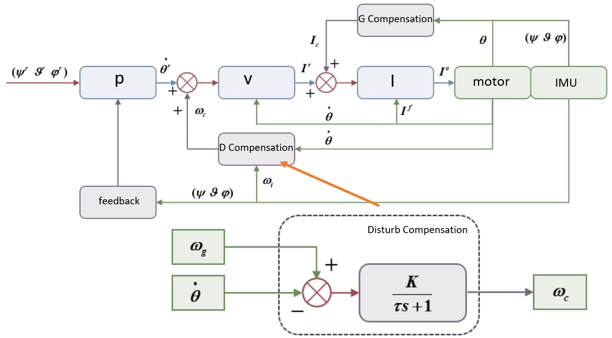
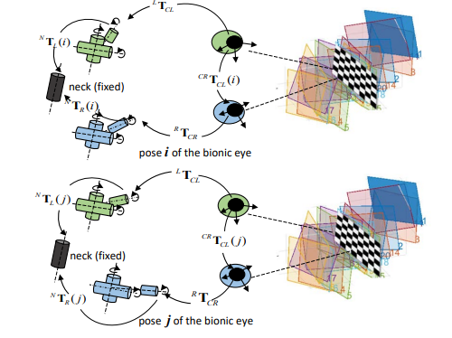
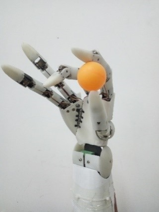

    Changjin Wang

    

        

            &emsp;I   am currently a robot algorithm engineer at Huawei's Central Research Laboratories , focusing on the key technologies of robots like motor control，robotic arm motion planning and dynamics control,wheel-leg robot whole-body nonlinear MPC control. I graduated from Beijing Institute of Technology(BIT) with a bachelor's degree in mechanical and electronic engineering in 2017. I was subsequently guanranted enrolled in the Robotics Institute of BIT and got a master degree in 2020. I received joint training and graduate guidance at the University of Auckland(UoA), New Zealand.
        

    

    

        
    

## Publications

1:  An integrated two-pose calibration method for estimating head-eye parameters of a robotic bionic eye[J]. **IEEE Transactions on Instrumentation and Measurement**, 2019, 69(4): 1664-1672. Chen Xiaopeng, Wang Changjin, Zhang Weizhong, et al.(2th Author, First Author is my tutor)

[paper](https://ieeexplore.ieee.org/document/8716717) 

2: The Design and Development of an Anthropomorphic Worm-Gear Driven Robotic Hand: BIT-JOCKO.   2019 IEEE 4th **International Conference on Advanced Robotics and Mechatronics (ICARM)**.Changjin Wang,Yao Sun,Jiafeng Xu.etc.   Best Paper Finalist

[paper](https://ieeexplore.ieee.org/document/8834213)

## Work & Research
(The following work is finished as main contributor,some work is publish-limited)

#### Hybrid robot consisit of 18-DOF legged robot + robotic arm

 The entire system consists of a 12-DOF wheel-legged robot + 6-DOF robotic arm. The legged robot adopts a similar algorithmic framework as ETH and uses Acados nonlinear MPC control. Floating base kinematic dynamics are employed to achieve 18-DOF full-body Jacobian non-space control and whole-body grasping. It can achieve balance obstacle crossing and chicken head stability.

##### Some demos：

   <iframe src="data/demo.mp4" width="250" height="180" frameborder="0" allowfullscreen></iframe>
  <iframe src="data/allV2.mp4" width="250" height="180" frameborder="0" allowfullscreen></iframe>
  <iframe src="data/wbcGRASP1.mp4"  width="250" height="180" frameborder="0" allowfullscreen></iframe>

  <iframe src="data/demo.mp4" width="320" height="180" style="flex: 1; margin: 0 10px;" frameborder="0" allowfullscreen></iframe>
  <iframe src="data/allV2.mp4" width="320" height="180" style="flex: 1; margin: 0 10px;" frameborder="0" allowfullscreen></iframe>
  <iframe src="data/wbcGRASP1.mp4" width="320" height="180" style="flex: 1; margin: 0 10px;" frameborder="0" allowfullscreen></iframe>

  <iframe src="data/chickenHead.mp4" width="250" height="110" frameborder="0" allowfullscreen></iframe>
  <iframe src="data/chickenHeadReal.mp4" width="250" height="110" frameborder="0" allowfullscreen></iframe>
  <iframe src="data/openDoor.mp4"  width="250" height="110" frameborder="0" allowfullscreen></iframe>

#### An unified implementation of Point-mass model for 4WIS robot

In this work I approach adopts a continuous optimization mindset to unify the four wheel modes. A single optimization formula is used to address the issues of lateral, oblique, Ackerman steering, and in-place spinning within the four-wheel steering context. This is in contrast to the traditional 4WIS independent control methods, which rely on discrete judgments to switch between motion modes. With this method, the controller can automatically decompose any VX, VY, W commands given to the vehicle in a two-dimensional plane into a point-mass model

##### Some demos：

   <iframe src="data/centroid.png" width="250" height="110" frameborder="0" allowfullscreen></iframe>
  <iframe src="data/centroid_simulation.mp4" width="250" height="110" frameborder="0" allowfullscreen></iframe>
  <iframe src="data/centroid_model.mp4"  width="250" height="110" frameborder="0" allowfullscreen></iframe>

#### A low-cost, low-inertia, low-mass compliant force-controlled robotic arm

In response to the challenges faced by mobile robots in terms of the existing UR arm, which is costly, heavy, and inconvenient for mobile robots like quadruped deployments, a new lightweight and low-inertia robotic arm with a PIEPPER configuration has been designed. This arm completes kinematics, dynamics, trajectory planning, motion interpolation, and polynomial interpolation based on self-developed FOC (Field-Oriented Control) drivers. Moveit architecture has been discarded, and in its place, a real-time high-performance lightweight robot library has been independently written. The 5kg arm can carry a 2KG payload with a repeatability of about 1mm, and it is cost-effective, making it very suitable for mobile robots to carry.

##### Some demos：

  <iframe src="data/robotArm2KG.mp4" width="250" height="180" frameborder="0" allowfullscreen></iframe>
  <iframe src="data/robotArm.mp4"  width="250" height="180" frameborder="0" allowfullscreen></iframe>
  <iframe src="data/zeroGravity.mp4" width="250" height="180" frameborder="0" allowfullscreen></iframe>

##### Partner video: [BiliBili](https://www.bilibili.com/video/BV1Wz4y1V7vL/?spm_id_from=333.999.0.0)

#### One biomimetic eye attitude stabilization algorithm based on a gravity compensation

This project is a research topic during the master's degree stage, focusing on how biomimetic eye robots maintain mechanical stability during motion. A biomimetic eye mechanical stabilization algorithm based on gravity compensation and attitude disturbance observation has been proposed. It compensates for the dynamic response delay caused by gravity and serves as a force feedforward. Meanwhile, an observer is utilized to predict and observe disturbances in advance, which acts as a velocity feedforward. This approach has achieved a disturbance rejection of 5Hz and above with a peak angle of 10°, while maintaining the end-effector's stability within 0.5°.

  

    
  

  

    <video width="320" height="180" controls>
      <source src="data/bioeye_stable.mp4" type="video/mp4">
  

    

#### An online bionic eye external parameter calibration and computation algorithm

For biomimetic eye robots, the binocular cameras require movement, but once the cameras move, the external parameters (ex-params) are disrupted. To address this issue, a method for offline calibration and online real-time computation of binocular external parameters is proposed. This method operates the biomimetic eyes to real-time compute the external parameters during motion. As a result, the binocular cameras can accurately locate points in the overlapping field of view and recover depth information, even while moving. Compared to fixed cameras, this approach increases the field of view for moving cameras.

  

    
  

  

    <video width="250" height="180" controls>
      <source src="data/bioeye_depth.mp4" type="video/mp4">
  

    

#### A biomimetic eye active exploration algorithm based on eye-foot coordination

Utilizing biomimetic eyes as an active stereo vision platform, mounted on a mobile robot to achieve Active SLAM (Simultaneous Localization and Mapping). By leveraging the projection maps of Octomap, combined with Gmapping's contour maps, the algorithm seeks visual reconstruction voids, which are the missing points in the 3D scene. Using an effect function to determine the access order of these void points, and integrating the BV (Best View) concept, the algorithm employs the ray projection method to determine the information gain of the field of view. Furthermore, based on position-based visual servoing, the biomimetic eyes are directed to always gaze in the direction of maximum information gain. A exploration strategy based on eye-foot coordination is set, and tasks are allocated based on the ratio of 3D scene coverage to 2D map coverage. This enables the robot to efficiently complete full-angle 3D reconstruction and 2D map construction in completely unfamiliar environments with a one-click start and full autonomy.

<iframe src="//player.bilibili.com/player.html?bvid=BV1Fm411X7ac&page=1" scrolling="no" border="0" frameborder="no" framespacing="0" allowfullscreen="true" width="640" height="480"> </iframe>

  

#### An adaptive  dexterous hand

The worm gear is used to realize the self-locking of the dexterous hand power-off structure, which can theoretically bear the weight within the allowable range of the structural strength. It adopts a modular knuckle design, a highly anthropomorphic design, and has 20 degrees of freedom. It also increases the degree of freedom of the palm side swing, increasing the palm grasping space by 30%.

  

    
  

  

    <video width="480" height="360" controls>
      <source src="data/hand.mp4" type="video/mp4">
  

    

## Skills:

C++, Python, MATLAB, proficient in robotic arm lower-level kinematics, dynamics, floating base dynamics, trajectory planning, with self-written libraries; also have strong theoretical derivation ability and solid engineering skills, the ability to insight the essence and bottleneck of problems, familiar with optimal control, no-linear MPC, have a set of own FOC controller supports dual encoder 3-ring control various feedforward and GUI interface.

## Honors:

Worked at Huawei for 3 years, received two annual A awards, top 15%, and one annual B+.
National Scholarship（研究生国家奖学金）
National Motivational Scholarship(国家励志奖学金)
Tang Nanjun Scholarship（唐南军奖学金）
SMC Scholarship（SMC 奖学金）
First-class Academic Scholarship for Graduate Students（研究生一等学业奖学金）
First Prize in the National College Student "Challenge Cup" Competition（全国大学生挑战杯一等奖）
First Prize in the National Aerospace Model Competition（全国科研类航空航天模型锦标赛一等奖）
Second Prize in the National College Student Energy Saving and Emission Reduction Competition（全国大学生节能减排大赛二等奖）
Top Ten Projects in the National College Student Innovation and Entrepreneurship Annual Meeting（全国互联网+ 大学生创新创业年会双十佳）

## Contact:

Email: bitchangjinwang123@163.com

  这里是您的页面内容。
